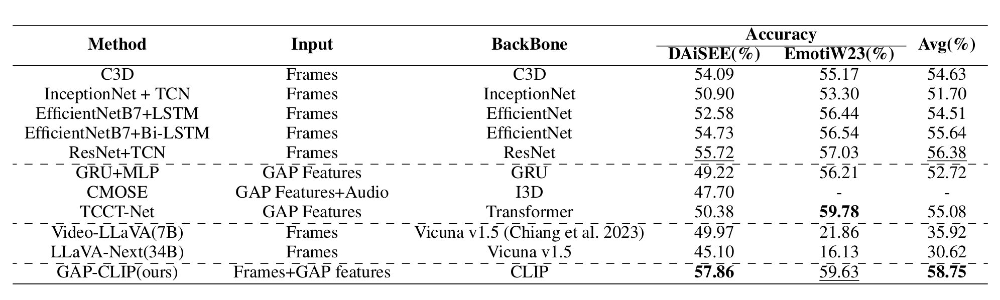
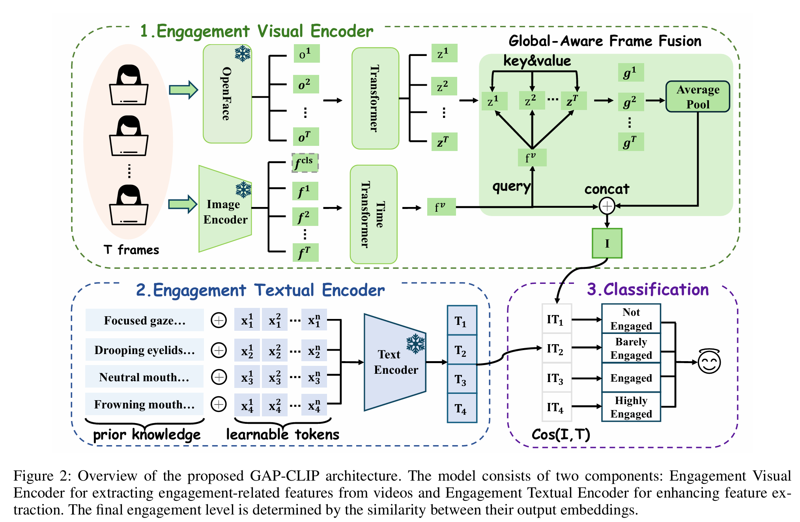

<h2 align="center"><strong>Beyond General Features: Equipping CLIP with Engagement-specific Cues for Student Engagement Detection</strong></h2> <p align="center"> <b>If you find this project useful, please consider starring ⭐ the repo!</b> </p>


## 🛠️ Project Log

* **[2025.08.01]** 📦📤 Initial codebase uploaded! 

## ✨ Highlights

🔍 We propose **GAP-CLIP**, an engagement-aware CLIP-based model that leverages domain-specific cues: **Gaze, Action units, and Pose (G-A-P)**.

🧠 We introduce a global-aware frame fusion strategy to combine general and engagement-specific visual information.

📚 A Textual Engagement Prior Encoder infuses semantic knowledge (e.g., "focused gaze implies engagement") to guide feature alignment.

🏆 Our model outperforms all baselines on **DAiSEE** and **Emotiw23** benchmarks.

## 📊 Main Results

<p align="center">  </p>

## 📦 Installation

```bash
# Create environment
conda create --name GAP-CLIP python=3.10
conda activate GAP-CLIP

# Install dependencies
pip install -r requirements.txt

```

## 🗂️ Dataset Preparation

**1.Download datasets**: 

+ [DAiSEE](https://people.iith.ac.in/vineethnb/resources/daisee/index.html)       
+ [EngageNet](https://github.com/engagenet/engagenet_baselines)

**2.Set up OpenFace** ([link](https://github.com/TadasBaltrusaitis/OpenFace)) for facial cue extraction. 

**3.Run preprocessing:**

```bash
python dataloader/VideoProcess.py
```

After running, processed data will appear under the `data/` folder, and label files under `annotation/`.

**4.Download CLIP checkpoint:**

+ Place the [CLIP-ViT-B-32](https://huggingface.co/sentence-transformers/clip-ViT-B-32) model in the `pretrain/` folder.

## 🚀 Training

```bash
# Train on DAiSEE
bash train_DAiSEE.sh

# Train on EngageNet
bash train_EmotiW.sh

```

results will be saved in ```log``` folder.

## 🧪 Baselines

We have reconstructed or obtained the following baselines for comparison:

| Model                   | Code File                                         |
| ----------------------- | ------------------------------------------------- |
| EfficientNet-LSTM       | `models/GenerateModel.py`                         |
| EfficientNet-BiLSTM     | `models/GenerateModel.py`                         |
| InceptionNet            | `models/GenerateModel.py`                         |
| ResNet+TCN              | `models/ResnetTCN.py`                             |
| TCCNet (augmented)      | `TCCNet/`                                         |
| Video-LLaVA, LLaVA-Next | `MLLMS/llava_video.py` + `finefune_videollava.py` |

## 🧠 Method Overview

<p align="center">  </p>


## 🔧 Environment Summary

| Component | Version      |
| --------- | ------------ |
| Python    | 3.10         |
| Platform  | Ubuntu 22.04 |

## ⭐ Acknowledgements
- [CLIP](https://github.com/openai/CLIP)
- [OpenFace](https://github.com/TadasBaltrusaitis/OpenFace)
- [DAiSEE](https://people.iith.ac.in/vineethnb/resources/daisee/index.html)
- [EngageNet](https://github.com/engagenet/engagenet_baselines)

